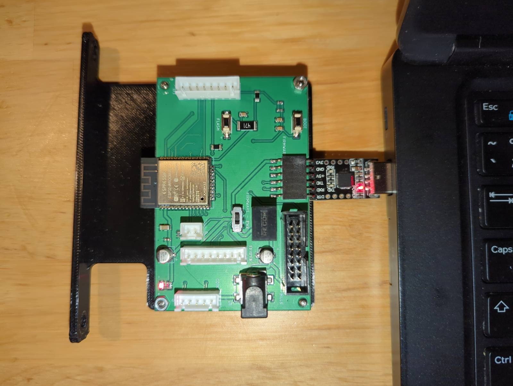

# Bleskomat Coins ATM

## Platform configuration

In Bleskomat Platform go to Devices > Device Settings

- _Reference Phrase_ - Two random words from Bip39 list used to identify the device.
- _Device Type_ - What Bleskomat device you are configuring.
- _Fiat Currency_ - The fiat currency that the device is going to accept. It requires hardware configuration so it is not possible to only change it here and make it work.
- _Exchange Rates_ - The provider used for the exchange rate that will be done at the moment for each trade.
- _Fee Percent (%)_ - Percentage of the fee that will be applied to every trade. This is how you make money.
- _Fixed Fee_ - A fixed fee denominated in the fiat currency of the device. This is how you make money.
- _Custom Invoice Memo Prefix_ - If set, this will replace the default invoice memo prefix - e.g. Bleskomat (absurd cake). Your ATM customers will see this in the memo field of their wallet application's invoice.

## Preparing board for hardware configuration

The only think you need, is to take the Bleskomat Board from the case and connect it with USB to your computer using the CP2101 connector that was provided with your device.

- Disassembling the Bleskomat Board

<video controls muted>
  <source src="./assets/disassembly-bleskomat-coin-board.mp4" type="video/mp4">
</video>

- Connecting Bleskomat Board to your computer with provided CP2101

## Hardware configuration from Bleskomat Platform

Once you have the board out of the box you connect it to your computer with USB and the Bleskomat Platform will manage the configurations for you.

- If you are on Windows you should install driver https://www.silabs.com/developers/usb-to-uart-bridge-vcp-drivers?tab=downloads
- If you are on Linux probably you will have to give permissions to your user to access USB running the command: "`sudo chown ${USER}:${USER} /dev/ttyUSB0`"

Steps:

1. Connect Bleskomat board to CP2101 provided
1. Make sure that the switch in the Bleskomat Board is set to "FIRMWARE"
1. Connect Bleskomat board to your computer USB
1. Open a supported browser (Google Chrome) with your platform account and go to Devices > Device Settings > Hardware configuration
1. Click on "Connect" and the browser should
1. You should see the message "Detecting Firmware"
1. Once "Detecting Firmware" is completed it will ask you to "Update Firmware"
1. After clicking on "Update Firmware" then in Bleskomat Board keep Button "FLASH" pressed while you press "BOOT" and it will trigger update.
1. One the Firmware update is completed it will try to reconnect to device. When you see the message "Reconnecting to device..." then in Bleskomat Board press "BOOT" button.
1. You should now see "Restarting Device" until you see "Done!"
1. You are done here!
1. Before assembling the board back to device make sure the switch in the board is set to PWR

The above described steps are display in the video below for clarification:

<video controls muted>
  <source src="./assets/bleskomat-coins-hardware-configuration.webm" type="video/mp4">
</video>
